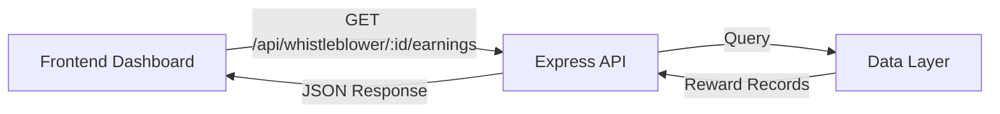

# Design Document: Whistleblower Earnings Dashboard

## Overview

The Whistleblower Earnings Dashboard feature provides a REST API endpoint that exposes earnings data for whistleblowers. The implementation follows the existing backend architecture patterns, using Express.js routing, Zod validation, and standardized error handling.

The endpoint returns two primary data structures:

1. **Earnings Totals**: Aggregated sums across all rewards (total, pending, paid)
2. **Earnings History**: Chronological list of individual reward records

The design assumes earnings data is stored in a data layer (database or smart contract) and focuses on the API layer that retrieves, aggregates, and formats this data for client consumption.

## Architecture

### System Context



### Component Structure

The implementation follows the existing backend patterns:

```
backend/src/
├── routes/
│   └── whistleblower.ts          # New router for whistleblower endpoints
├── schemas/
│   └── whistleblower.ts          # Zod schemas for request/response validation
├── services/
│   └── earnings.ts               # Business logic for earnings aggregation
└── app.ts                        # Register new router
```

### Data Flow

1. Client sends GET request to `/api/whistleblower/:id/earnings`
2. Express router validates the whistleblower ID parameter
3. Service layer queries data layer for all rewards belonging to the whistleblower
4. Service layer aggregates totals and formats history
5. Router returns JSON response with totals and history

## Components and Interfaces

### API Endpoint

**Route**: `GET /api/whistleblower/:id/earnings`

**Path Parameters**:

- `id` (string, required): The whistleblower's unique identifier

**Response Schema** (200 OK):

```typescript
{
  totals: {
    totalNgn: number,
    pendingNgn: number,
    paidNgn: number,
    totalUsdc?: number,    // Optional
    pendingUsdc?: number,  // Optional
    paidUsdc?: number      // Optional
  },
  history: [
    {
      rewardId: string,
      listingId: string,
      dealId: string,
      amountNgn: number,
      amountUsdc: number,
      status: "pending" | "payable" | "paid",
      createdAt: string,     // ISO 8601 timestamp
      paidAt?: string        // ISO 8601 timestamp, only present when status is "paid"
    }
  ]
}
```

**Error Responses**:

- `400 Bad Request`: Invalid whistleblower ID format
- `404 Not Found`: Whistleblower ID does not exist
- `500 Internal Server Error`: Unexpected server error

### Router Module

**File**: `backend/src/routes/whistleblower.ts`

Exports a factory function that creates an Express router:

```typescript
export function createWhistleblowerRouter(
  earningsService: EarningsService,
): Router;
```

The router:

- Validates path parameters using Zod middleware
- Calls the earnings service to retrieve data
- Handles errors using the existing AppError pattern
- Returns formatted JSON responses

### Service Module

**File**: `backend/src/services/earnings.ts`

Exports an interface and implementation for earnings business logic:

```typescript
interface EarningsService {
  getEarnings(whistleblowerId: string): Promise<EarningsData>;
}

interface EarningsData {
  totals: EarningsTotals;
  history: EarningsHistoryItem[];
}
```

The service:

- Queries the data layer for reward records
- Aggregates totals by status (pending/payable/paid)
- Sorts history by creation date (descending)
- Converts currency amounts to appropriate display formats

### Schema Module

**File**: `backend/src/schemas/whistleblower.ts`

Defines Zod schemas for validation and TypeScript types:

```typescript
// Path parameter validation
export const whistleblowerIdParamSchema = z.object({
  id: z.string().min(1, "Whistleblower ID is required"),
});

// Response schemas
export const earningsTotalsSchema = z.object({
  totalNgn: z.number(),
  pendingNgn: z.number(),
  paidNgn: z.number(),
  totalUsdc: z.number().optional(),
  pendingUsdc: z.number().optional(),
  paidUsdc: z.number().optional(),
});

export const earningsHistoryItemSchema = z.object({
  rewardId: z.string(),
  listingId: z.string(),
  dealId: z.string(),
  amountNgn: z.number(),
  amountUsdc: z.number(),
  status: z.enum(["pending", "payable", "paid"]),
  createdAt: z.string(),
  paidAt: z.string().optional(),
});

export const earningsResponseSchema = z.object({
  totals: earningsTotalsSchema,
  history: z.array(earningsHistoryItemSchema),
});

export type EarningsTotals = z.infer<typeof earningsTotalsSchema>;
export type EarningsHistoryItem = z.infer<typeof earningsHistoryItemSchema>;
export type EarningsResponse = z.infer<typeof earningsResponseSchema>;
```

## Data Models

### Reward Record (Internal)

The internal data model represents a single reward record from the data layer:

```typescript
interface RewardRecord {
  id: string; // Unique reward identifier
  whistleblowerId: string; // Foreign key to whistleblower
  listingId: string; // Foreign key to reported listing
  dealId: string; // Foreign key to deal
  amountUsdc: bigint; // Canonical amount in USDC (smallest unit)
  status: PayoutStatus; // Current payout status
  createdAt: Date; // When reward was created
  paidAt: Date | null; // When reward was paid (null if not paid)
}

type PayoutStatus = "pending" | "payable" | "paid";
```

### Currency Conversion

The system stores amounts in USDC (as the canonical value) and converts to NGN for display:

- **Storage**: USDC amounts stored as bigint (smallest unit, e.g., 1 USDC = 1,000,000 units)
- **Display**: Convert to decimal numbers for JSON response
- **NGN Conversion**: Apply exchange rate to USDC amount (rate sourced from configuration or external service)

Example conversion logic:

```typescript
function convertUsdcToNgn(usdcAmount: bigint, exchangeRate: number): number {
  const usdcDecimal = Number(usdcAmount) / 1_000_000; // Convert to decimal USDC
  return usdcDecimal * exchangeRate; // Apply exchange rate
}
```

### Aggregation Logic

Totals are calculated by filtering and summing reward records:

```typescript
function calculateTotals(
  rewards: RewardRecord[],
  exchangeRate: number,
): EarningsTotals {
  const totalUsdc = rewards.reduce((sum, r) => sum + r.amountUsdc, 0n);
  const pendingUsdc = rewards
    .filter((r) => r.status === "pending" || r.status === "payable")
    .reduce((sum, r) => sum + r.amountUsdc, 0n);
  const paidUsdc = rewards
    .filter((r) => r.status === "paid")
    .reduce((sum, r) => sum + r.amountUsdc, 0n);

  return {
    totalNgn: convertUsdcToNgn(totalUsdc, exchangeRate),
    pendingNgn: convertUsdcToNgn(pendingUsdc, exchangeRate),
    paidNgn: convertUsdcToNgn(paidUsdc, exchangeRate),
    totalUsdc: Number(totalUsdc) / 1_000_000,
    pendingUsdc: Number(pendingUsdc) / 1_000_000,
    paidUsdc: Number(paidUsdc) / 1_000_000,
  };
}
```

## Correctness Properties

_A property is a characteristic or behavior that should hold true across all valid executions of a system—essentially, a formal statement about what the system should do. Properties serve as the bridge between human-readable specifications and machine-verifiable correctness guarantees._

### Property Reflection

After analyzing the acceptance criteria, several properties can be consolidated:

- Properties 2.2, 2.3, 2.4 (NGN aggregation) and 2.5 (USDC aggregation) can be combined into comprehensive aggregation properties
- Property 1.3 (response structure) is subsumed by properties 2.1 and 3.1 which test the specific structures
- Property 3.2 (required fields) and 3.4 (status values) can be combined into a single schema validation property

The following properties represent the minimal set needed for comprehensive validation:

### Property 1: Response Structure Completeness

_For any_ valid whistleblower ID, the API response should contain a totals object with totalNgn, pendingNgn, and paidNgn fields, and a history array.

**Validates: Requirements 1.3, 2.1, 3.1**

### Property 2: Total Aggregation Correctness

_For any_ set of reward records, the totalNgn value should equal the sum of amountNgn across all rewards in the history, and totalUsdc (when present) should equal the sum of amountUsdc across all rewards.

**Validates: Requirements 2.2, 2.5**

### Property 3: Pending Aggregation Correctness

_For any_ set of reward records, the pendingNgn value should equal the sum of amountNgn for all rewards with status "pending" or "payable", and pendingUsdc (when present) should equal the sum of amountUsdc for those same rewards.

**Validates: Requirements 2.3, 2.5**

### Property 4: Paid Aggregation Correctness

_For any_ set of reward records, the paidNgn value should equal the sum of amountNgn for all rewards with status "paid", and paidUsdc (when present) should equal the sum of amountUsdc for those same rewards.

**Validates: Requirements 2.4, 2.5**

### Property 5: History Item Schema Validity

_For any_ reward item in the history array, it should contain rewardId, listingId, dealId, amountNgn, amountUsdc, status (one of "pending", "payable", or "paid"), and createdAt, and if status is "paid" then paidAt must be present.

**Validates: Requirements 3.2, 3.3, 3.4**

### Property 6: History Ordering

_For any_ history array with multiple items, each item's createdAt timestamp should be greater than or equal to the next item's createdAt (descending order).

**Validates: Requirements 3.5**

### Property 7: Invalid ID Error Handling

_For any_ invalid or non-existent whistleblower ID, the API should return a 404 status code with an error response.

**Validates: Requirements 1.4**

### Property 8: Aggregation Partition

_For any_ set of reward records, the sum of pendingNgn and paidNgn should equal totalNgn (and similarly for USDC amounts when present), since every reward is either pending/payable or paid.

**Validates: Requirements 2.2, 2.3, 2.4, 2.5**

## Error Handling

### Error Scenarios

The implementation handles the following error conditions:

1. **Invalid Whistleblower ID Format**
   - Trigger: Empty string or malformed ID in path parameter
   - Response: 400 Bad Request
   - Error code: `VALIDATION_ERROR`
   - Message: "Whistleblower ID is required" or similar validation message

2. **Whistleblower Not Found**
   - Trigger: Valid ID format but no matching whistleblower exists
   - Response: 404 Not Found
   - Error code: `NOT_FOUND`
   - Message: "Whistleblower not found"

3. **Data Layer Failure**
   - Trigger: Database query fails or smart contract call fails
   - Response: 500 Internal Server Error
   - Error code: `INTERNAL_ERROR` or `SOROBAN_ERROR`
   - Message: "Failed to retrieve earnings data"

4. **Currency Conversion Failure**
   - Trigger: Exchange rate unavailable or conversion error
   - Response: 500 Internal Server Error
   - Error code: `INTERNAL_ERROR`
   - Message: "Failed to convert currency amounts"

### Error Response Format

All errors follow the existing AppError pattern:

```json
{
  "error": {
    "code": "NOT_FOUND",
    "message": "Whistleblower not found",
    "details": {
      "whistleblowerId": "invalid-id-123"
    }
  }
}
```

### Error Handling Strategy

- Use existing `AppError` class and factory functions (`notFound`, `internalError`)
- Validate path parameters using Zod middleware before service layer
- Catch data layer exceptions and convert to appropriate AppError instances
- Let the global error handler middleware serialize errors consistently
- Log errors with request context for debugging

## Testing Strategy

### Dual Testing Approach

The implementation requires both unit tests and property-based tests for comprehensive coverage:

- **Unit tests**: Verify specific examples, edge cases, and error conditions
- **Property tests**: Verify universal properties across all inputs

### Unit Testing

Unit tests focus on:

1. **Specific Examples**
   - Test endpoint with a known whistleblower ID and verify expected response structure
   - Test with a whistleblower who has no rewards (empty history, zero totals)
   - Test with a whistleblower who has only pending rewards
   - Test with a whistleblower who has only paid rewards
   - Test with a whistleblower who has mixed status rewards

2. **Edge Cases**
   - Empty whistleblower ID parameter
   - Very long whistleblower ID string
   - Special characters in whistleblower ID
   - Whistleblower with single reward
   - Rewards with zero amounts

3. **Error Conditions**
   - Non-existent whistleblower ID returns 404
   - Malformed request returns 400
   - Data layer failure returns 500

4. **Integration Points**
   - Router correctly calls service layer
   - Service layer correctly queries data layer
   - Currency conversion is applied correctly
   - Response serialization matches schema

### Property-Based Testing

Property tests verify the correctness properties defined above using a property-based testing library. For TypeScript/Node.js, we will use **fast-check**.

**Configuration**:

- Minimum 100 iterations per property test
- Each test tagged with comment referencing design property
- Tag format: `// Feature: whistleblower-earnings-dashboard, Property {number}: {property_text}`

**Test Structure**:

```typescript
import fc from "fast-check";

// Feature: whistleblower-earnings-dashboard, Property 2: Total Aggregation Correctness
test("total amounts equal sum of all rewards", () => {
  fc.assert(
    fc.property(fc.array(rewardRecordArbitrary), (rewards) => {
      const response = calculateEarnings(rewards);
      const expectedTotalNgn = rewards.reduce((sum, r) => sum + r.amountNgn, 0);
      expect(response.totals.totalNgn).toBeCloseTo(expectedTotalNgn, 2);
    }),
    { numRuns: 100 },
  );
});
```

**Generators (Arbitraries)**:

Define generators for test data:

```typescript
const payoutStatusArbitrary = fc.constantFrom("pending", "payable", "paid");

const rewardRecordArbitrary = fc.record({
  id: fc.uuid(),
  whistleblowerId: fc.uuid(),
  listingId: fc.uuid(),
  dealId: fc.uuid(),
  amountUsdc: fc.bigInt({ min: 0n, max: 1_000_000_000n }),
  status: payoutStatusArbitrary,
  createdAt: fc.date(),
  paidAt: fc.option(fc.date(), { nil: null }),
});
```

**Property Test Coverage**:

Each of the 8 correctness properties should have a corresponding property-based test:

1. Property 1: Generate random reward sets, verify response structure
2. Property 2: Generate random reward sets, verify total aggregation
3. Property 3: Generate random reward sets, verify pending aggregation
4. Property 4: Generate random reward sets, verify paid aggregation
5. Property 5: Generate random reward sets, verify each history item schema
6. Property 6: Generate random reward sets, verify history ordering
7. Property 7: Generate random invalid IDs, verify 404 responses
8. Property 8: Generate random reward sets, verify partition property (pending + paid = total)

### Test Organization

```
backend/src/
├── routes/
│   ├── whistleblower.ts
│   └── whistleblower.test.ts          # Unit tests for router
├── services/
│   ├── earnings.ts
│   ├── earnings.test.ts               # Unit tests for service
│   └── earnings.property.test.ts      # Property-based tests
└── schemas/
    ├── whistleblower.ts
    └── whistleblower.test.ts          # Schema validation tests
```

### Testing Dependencies

Add fast-check to development dependencies:

```bash
npm install --save-dev fast-check
```

### Test Execution

- Unit tests run as part of standard test suite: `npm test`
- Property tests run with same command (no separate execution needed)
- CI pipeline should run all tests before merging
- Linting and type checking run before tests: `npm run lint && npm run type-check`
